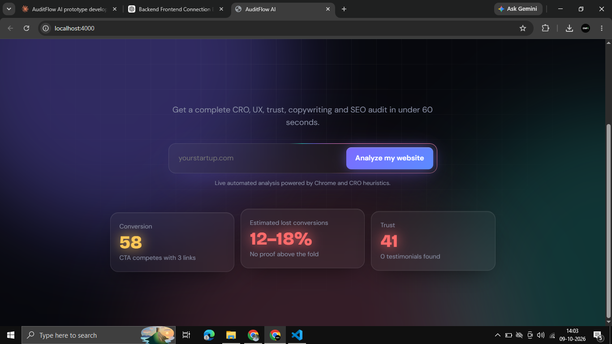
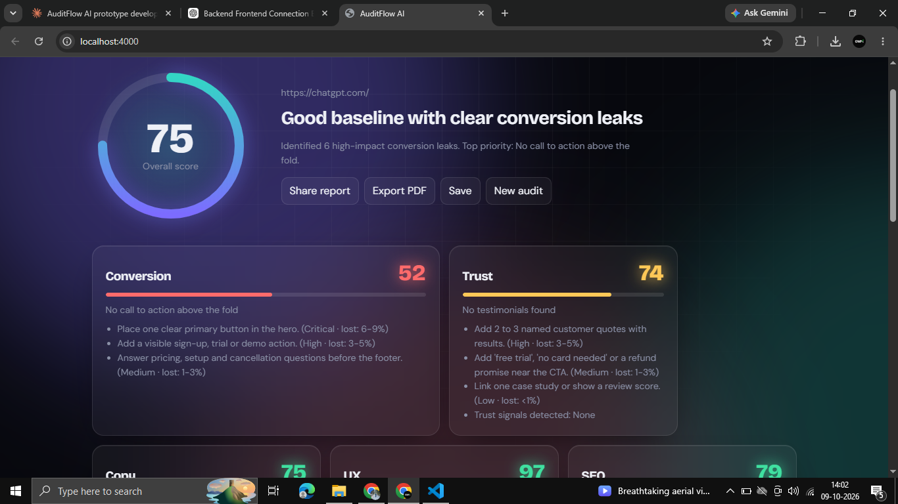
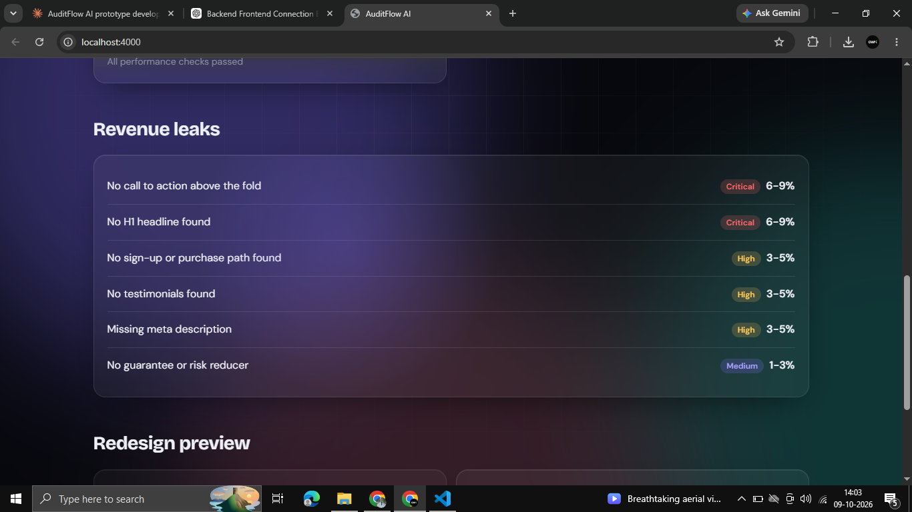

# AuditFlow AI

**Find out why your landing page isn't converting, in about a minute.**

AuditFlow AI loads any public landing page in a real browser, captures desktop and mobile screenshots, and produces a scored conversion audit covering CRO, trust, copywriting, UX, SEO and performance. Every issue comes with a severity level, a recommended fix and an estimated range of lost conversions.



---

## Table of contents

- [Features](#features)
- [Screenshots](#screenshots)
- [How it works](#how-it-works)
- [Tech stack](#tech-stack)
- [Project structure](#project-structure)
- [Getting started](#getting-started)
- [API reference](#api-reference)
- [Scoring model](#scoring-model)
- [Security](#security)
- [Known limitations](#known-limitations)
- [Roadmap](#roadmap)
- [License](#license)

---

## Features

- **Live audit engine.** Pages are rendered in headless Chrome, so JavaScript-heavy sites are analysed as visitors see them.
- **Six scored categories.** Conversion, Trust, Copy, UX, SEO and Performance, each scored 0 to 100, plus a weighted overall score.
- **Revenue leak detection.** Issues are ranked by severity (Critical, High, Medium, Low), each with an estimated conversion loss range.
- **Real-time progress.** The interface shows each analysis step as it runs: structure, screenshots, CTAs, copy, trust signals, scoring and recommendations.
- **Desktop and mobile screenshots.** Full-page captures saved for every audit.
- **Premium interface.** Dark glass theme with an aurora background, animated score ring, expandable report cards, light/dark mode and a command palette (`Ctrl/Cmd + K`).
- **Free to run.** No paid APIs or external services. Everything runs locally.

## Screenshots

| Audit report | Revenue leaks |
| --- | --- |
|  |  |

> Save your screenshots in `docs/screenshots/` as `landing.png`, `report.png` and `leaks.png` so the images above display.

## How it works

```
URL ──► Validate ──► Render (Puppeteer) ──► Extract ──► Rule checks ──► Scores + report
        SSRF guard    desktop + mobile       DOM + HTML    per category     JSON via API
```

1. **Validate.** The URL is parsed, resolved through DNS and rejected if it points to a private or internal address.
2. **Render.** Puppeteer opens the page at 1366×768, waits for the network to settle, records load time and requests, then takes a full-page screenshot. It repeats the process at 390×844 for mobile.
3. **Extract.** The rendered DOM and HTML (parsed with Cheerio) provide headings, buttons and their positions, images, meta tags, navigation links and trust-signal text.
4. **Check.** A set of rules runs per category. Each failed rule creates an issue with a severity, a fix and an estimated impact.
5. **Score.** Penalties reduce each category score. The overall score is a weighted average.

## Tech stack

| Layer | Technology |
| --- | --- |
| Frontend | HTML, CSS and vanilla JavaScript (single file, no build step) |
| Backend | Node.js, Express |
| Rendering | Puppeteer (headless Chrome) |
| Parsing | Cheerio |
| Storage | In-memory (PostgreSQL planned) |

## Project structure

```
auditflow-ai/
├── README.md
├── docs/
│   └── screenshots/        Project screenshots
├── frontend/
│   └── index.html          Landing page, progress view and report UI
└── backend/
    ├── server.js           Express server, job handling, rate limiting
    ├── analyzer.js         Page capture, extraction and scoring rules
    ├── package.json
    └── shots/              Generated screenshots (created at runtime)
```

## Getting started

### Prerequisites

- Node.js 18 or later
- About 400 MB of free disk space (Puppeteer downloads Chromium)

### Installation

```bash
cd backend
npm install
npm start
```

Open **http://localhost:4000** in your browser, enter a URL and select **Analyze my website**.

The backend serves the frontend, so one command runs the whole app. Set the `PORT` environment variable to use a different port.

## API reference

### `POST /api/audit`

Starts an audit.

```bash
curl -X POST http://localhost:4000/api/audit \
  -H "Content-Type: application/json" \
  -d '{"url":"example.com"}'
```

Response `202 Accepted`:

```json
{ "id": "a1b2c3d4e5" }
```

| Status | Meaning |
| --- | --- |
| `202` | Audit started |
| `400` | Invalid or non-public URL |
| `429` | Rate limit reached (3 audits per minute per IP) |

### `GET /api/audit/:id`

Returns the current status. Poll it until `status` is `done` or `error`.

```json
{
  "status": "running",
  "step": "Checking CTAs"
}
```

When finished, the response includes the report:

| Field | Description |
| --- | --- |
| `report.overall` | Weighted overall score (0 to 100) |
| `report.scores` | Score per category |
| `report.issues` | All issues with `category`, `severity`, `title`, `fix`, `lost` |
| `report.leaks` | Top issues ranked by severity |
| `report.extracted` | Title, meta description, H1, CTAs, navigation, image weight, load time |
| `report.screenshots` | Paths to desktop and mobile screenshots |

## Scoring model

Each category starts at 100. Every issue subtracts points based on its severity, with a minimum score of 5.

| Severity | Penalty | Estimated lost conversions |
| --- | --- | --- |
| Critical | 25 | 6–9% |
| High | 15 | 3–5% |
| Medium | 8 | 1–3% |
| Low | 3 | under 1% |

Overall score weights: Conversion 25%, Trust 20%, Copy 20%, UX 15%, SEO 10%, Performance 10%.

**Checks include:** CTA presence, wording and competition above the fold; headline length and buzzwords; customer-focused versus company-focused copy; social proof, testimonials, guarantees and FAQ; titles, meta descriptions, H1 count, alt text and canonical links; mobile viewport and horizontal overflow; navigation size; image weight, lazy loading, script count and load time.

> Lost-conversion ranges are estimates derived from CRO benchmarks. They are not measured data from your site.

## Security

- **SSRF protection.** Private, loopback and link-local addresses are rejected before any page is loaded.
- **Rate limiting.** Three audit requests per minute per IP address.
- **Protocol allow-list.** Only `http` and `https` URLs are accepted.

If you deploy this publicly, also run it in a container, set stricter resource limits and add authentication.

## Known limitations

- Some sites block automated browsers or show a bot-check page. These audits can report missing headlines or calls to action that exist for real visitors.
- Pages behind a login are not supported.
- Reports are stored in memory and are lost when the server restarts.
- Findings come from fixed rules. They check structure and common patterns, not whether your offer is the right one.

## Roadmap

- [ ] Persistent storage with Prisma and PostgreSQL
- [ ] Public shareable report links
- [ ] PDF export
- [ ] Audit history, search and comparison
- [ ] Competitor comparison (two URLs side by side)
- [ ] AI-written headline rewrites using a local model (Ollama)
- [ ] User accounts and authentication
- [ ] Docker setup for deployment

## License

Released under the MIT License. 
